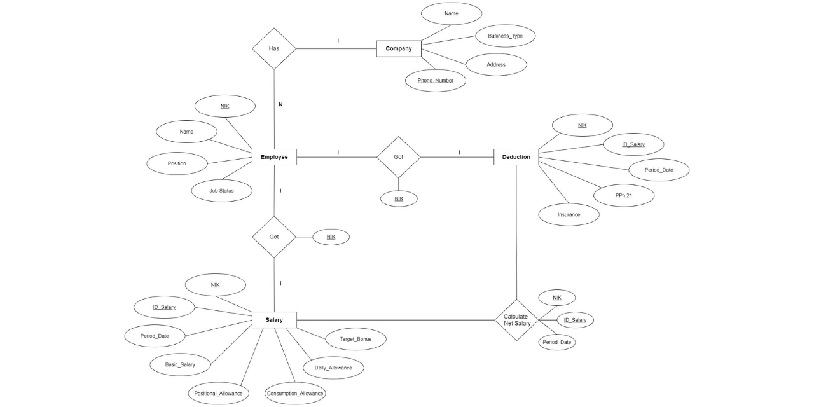

# Entity Relationship Diagram from an Employee Salary Slip
This is the final project of my Database System course. In this project, I created an Entity Relationship Diagram from an Employee Salary Slip using draw.io software with the explanation of each entity in the diagram and also the relationship and the cardinality between the entity.

For more detail about the entity relationship diagram that I made, you may download and read the report that I have already attached.

